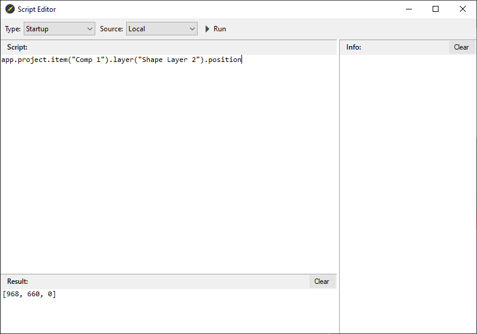
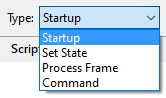
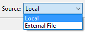
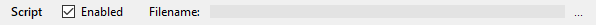

## Описание

Сценарий – это серия команд, которые предписывают приложению выполнить серию операций.

> JavaScript - это платформонезависимый язык сценариев, который можно использовать для управления многими функциями и автоматизации многих задач в шаблонах Carrot.

## Разработка и отладка

Для помощи в разработке, отладке и тестировании скриптов предоставляется интерактивная среда разработки и тестирования.

Редактор сценариев Carrot 
 в **Template Preview**, `Edit` > `Scripts`

### Типы скриптов

Тип | Выполнение
- | -
Startup | Один раз после загрузки ресурсов шаблона в **Carrot Engine**.
Set State | При каждой смене состояния загруженного шаблона (play, stop, next и т.д.).
Process Frame | Каждый кадр.
Command | При получение комманды от другого скрипта.

### Источник скрипта

Тип | Источник
- | -
Local | Встроенный в шаблон.
External File | Внешний файл.

Внешний файл можно выбрать на панели `Script` нажав на кнопку `...`

### Тестовый запуск

Выполнить скрипт можно нажав на кнопку `Run` или <kbd>F5</kbd> на клавиатуре.

### Отладка

Процесс подключения и настройки внешнего отладчика описан в разделе [Настройка VS Code](scripting_vscode.md?id=visual-studio-code)

## Руководство AE

Дополнительную информацию по скриптам AE можно посмотреть [здесь](https://ae-scripting.docsforadobe.dev/).