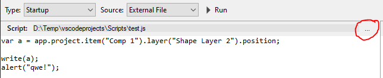
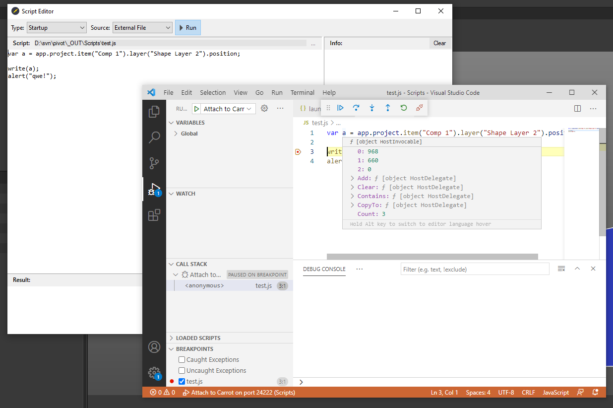

## Visual Studio Code

Для отладки скриптов лучше использовать VS Code: [code.visualstudio.com](https://code.visualstudio.com/)

### Открытие каталога проекта
- `File` > `Open Folder`
- Выберите каталог вашего проекта

### Создание задачи запуска отладки
Необходимо создать задачу отладки для VS Code, которая будет запускаться, когда вы хотите отлаживать скрипты.

В каталоге вашего проекта:
- создайте папку с именем **.vscode** (с точкой)
- в этой папке создайте файл **launch.json**
- вставьте следующий код:
    ```json
    {
        "version": "0.2.0",
        "configurations": [
            {
                "name": "Attach to Carrot",
                "type": "node",
                "request": "attach",
                "protocol": "auto",
                "address": "localhost",
                "port": 24222
            }
        ]
    }
    ```

### Запуск отладчика
После того, как вы настроите свою среду выполнения:
- В **Carrot Template Preview**, `Edit` > `Scripts`. Откроется редактор сценариев Carrot.
- Выберите файл из каталога проекта VS Code, `Source` > `External File`, нажмите на кнопку `...` и укажите файл.
    
    

- В **VS Code**, `Run` > `Start Debugging` > `Attach to Carrot`.
- В **редакторе скриптов Carrot**, выполните скрипт нажав на кнопку `Run` или <kbd>F5</kbd> на клавиатуре.
- Если скрипт выдаст какие-либо ошибки, вы сможете просматривать переменные и cтек вызовов (call stack).

    