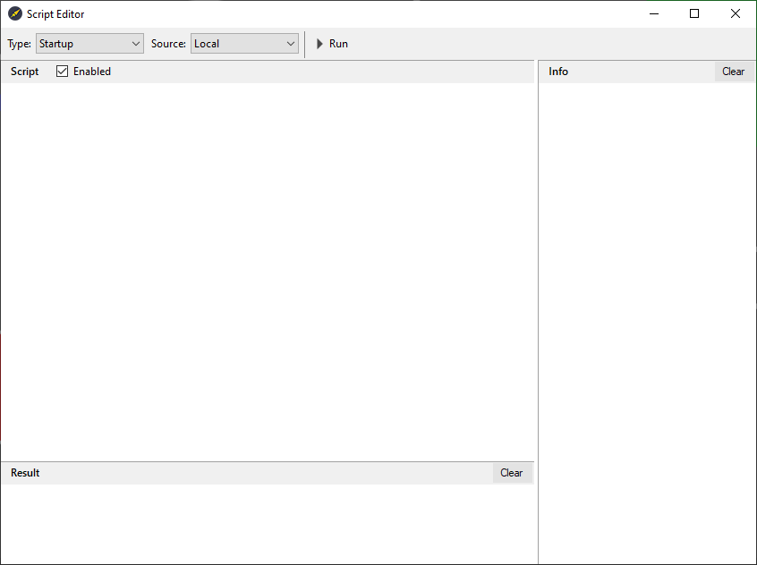
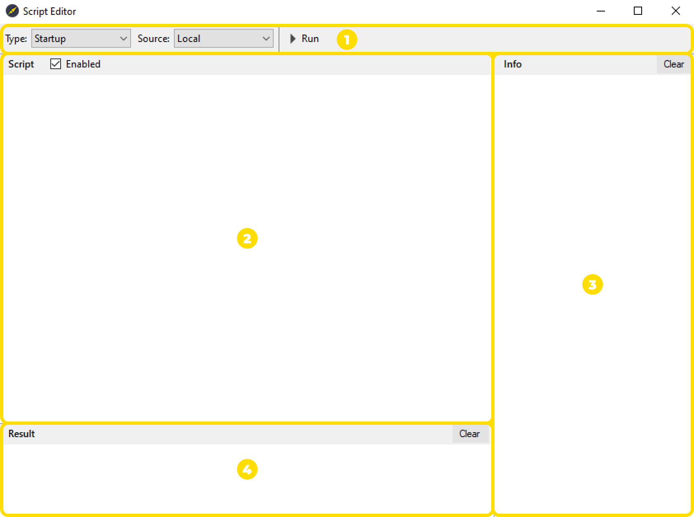
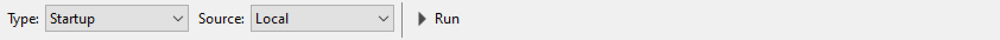
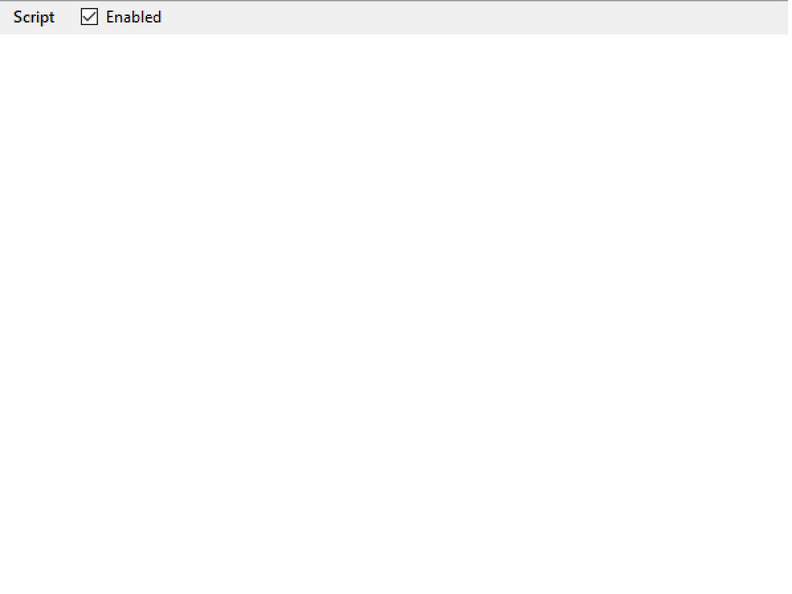
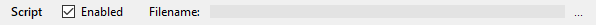
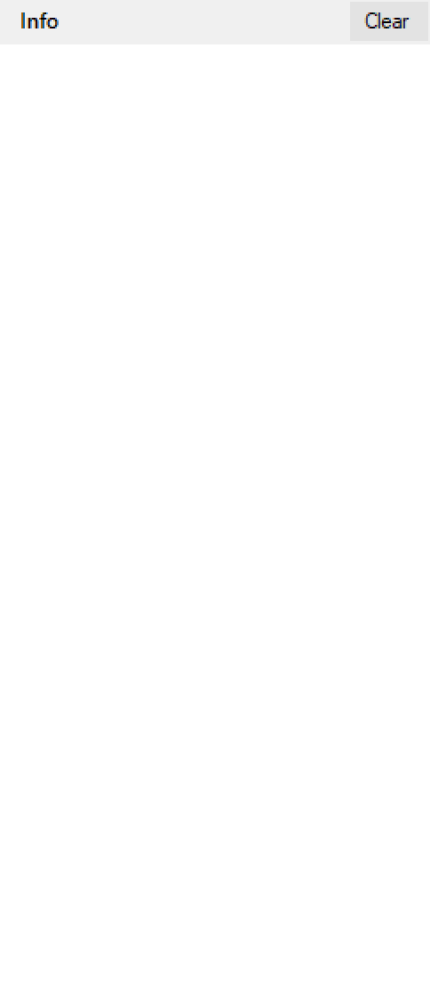
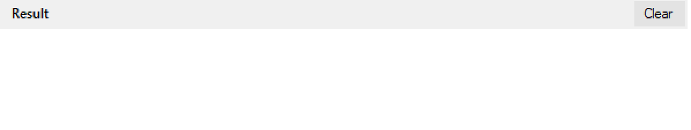

# Знакомство с интерфейсом

## Первый взгляд

Интерфейс **Script Editor** позволяет легко создавать и тестировать скрипты. Все действия происходят в реальном времени, чтобы Вы могли быстро проверять идеи и исправлять ошибки.

## Ваши рабочие области

Интерфейс **Script Editor** включает в себя следующие области

| Область | Описание |
| -- | -- |
| Панель управления | Содержит кнопки и команды, которые управляют запуском сценария. |
| Сценарии | Основное рабочее пространство для создания и редактирования сценария. |
| Info | Отображение результата выполнения отдельных функций и вспомогательных сообщений сценария. |
| Result | Отображение результата выполнения сценария. |

### Панель управления

Панель управления содержит кнопки и команды для запуска, остановки и настройки типов сценариев. Ниже в таблице перечислены основные элементы и их назначение.

| Элемент | Описание | Примечание |
| -- | -- | -- |
| Type | Выбор типа сценария. | Каждый тип сценария определяет, когда и как он выполняется:   1. `Startup` - выполняется один раз после загрузки шаблона в Carrot Engine (с помощью веб-интерфейса Carrot Dashboard). Чтобы выполнить сценарий повторно, выгрузите шаблон и загрузите его снова. Используйте этот тип сценария при объявлении переменных, инициализации данных и определения вспомогательных функций;   2. `Set State` - выполняется при каждом изменении состояния загруженного шаблона ("Take IN", "Take OUT"). Используйте этот тип для тех случаев, когда сценарий должен срабатывать при каждом входе ("Take IN") и выходе ("Take OUT") шаблона;   3. `Process Frame` - выполняется каждый кадр. Используйте этот тип сценариев для анимаций, обновления значений и логики, которая должна работать непрерывно во время воспроизведения;   4. `Command` - выполняется при получении команды от события (специальной команды, удалённого сценария или т.п.). В текущей версии этот тип не активен. Вы можете использовать его как черновик для тестирования написанного сценария. |
| Source | Выбор источника сценария. | Источник сценария бывает определяет откуда выполняется сценарий:   1. `Local` - использует сценарии написанные в области **"Сценарии"**;   2. `External File` - использует внешний файл со сценарием. Область **"Сценарии"** становится недоступной для редактирования, при этом отображается поле **"Filename"**, где с помощью кнопки `...` можно выбрать внешний файл со сценарием. |
| ▸ Run | Выполнение сценария. | Выполнить скрипт можно также с помощью клавиши `F5` на клавиатуре. |

### Сценарии

Область **"Сценарии"** это основное рабочее пространство для создания и редактирования сценария. В данной области также есть переключатель `Enabled`, который включает или отключает выполнение сценария выбранного типа (`Startup`, `Set State`, `Process Frame` и `Command`).

!> При выборе источника сценария `External File`, область **"Сценарии"** становится недоступной для редактирования, при этом отображается поле **"Filename"**, где с помощью кнопки `...` можно выбрать внешний файл со сценарием.     

### Info

Область **"Info"** выводит результат выполнения отдельных функций и вспомогательные сообщения. Данная область помогает отлаживать логику сценария. При необходимости, можно очистить содержимое области с помощью кнопки `Clear`.

### Result

Область **"Result"** отображает итог выполнения сценария. Используйте эту область для проверки общей логики поведения сценария. При необходимости, можно очистить содержимое области с помощью кнопки `Clear`.
