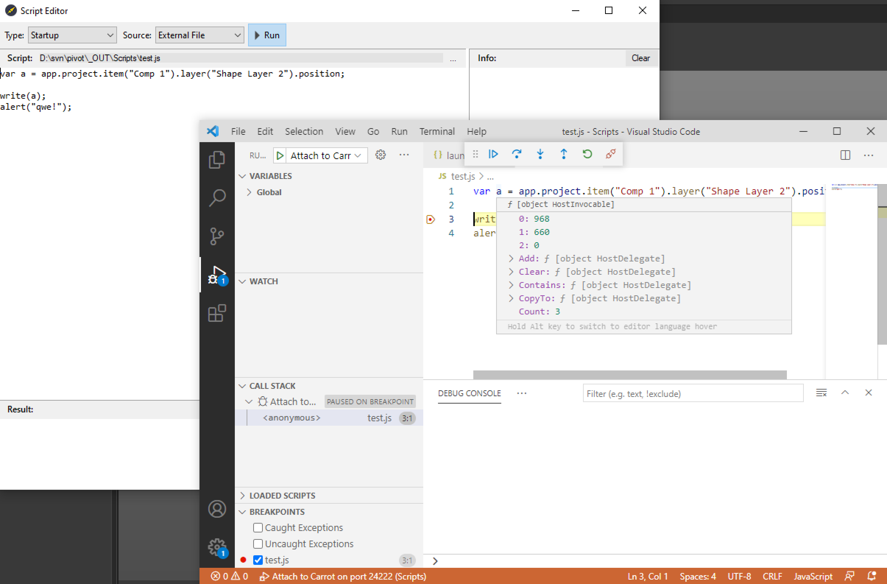

# Организация рабочего пространства

Для удобного написания сценариев рекомендуется использовать редактор кода **Visual Studio Code**.

Скачать **Visual Studio Code** можно [здесь](https://code.visualstudio.com/).

## Открытие папки проекта

1. Запустите **Visual Studio Code**;
2. Выберите в меню **File** → **Open Folder** (или нажмите `Ctrl+K Ctrl+O`);
3. Укажите папку со сценариями.

Теперь **Visual Studio Code** видит структуру проекта и готов к работе.

## Настройка отладки

1. В корне папки со сценариями, создайте папку **".vscode"** (именно с точкой в начале названия);
2. Внутри папки **".vscode"** создайте файл **launch.json**;
3. Вставьте в файл **launch.json** код ниже и сохраните.

```json
{
    "version": "0.2.0",
    "configurations": [
        {
            "name": "Attach to Carrot",
            "type": "node",
            "request": "attach",
            "protocol": "auto",
            "address": "localhost",
            "port": 24222
        }
    ]
}
```

## Запуск отладки

1. Откройте **Script Editor**;
2. Выберите источник сценария (**"Source"**) `External File`;
3. Нажмите `...` и укажите файл со сценарием (".js") из папки проекта **Visual Studio Code**;
4. В **Visual Studio Code** нажмите в верхней панели **Run** → **Start Debugging** → **Attach to Carrot**;
5. Вернитесь в **Script Editor** и запустите сценарий (`▸ Run` или `F5` на клавиатуре).

Если в сценарии возникнет ошибка - **Visual Studio Code** покажет текущие значения всех переменных, стек вызовов (call stack) и строку где произошла проблема.


